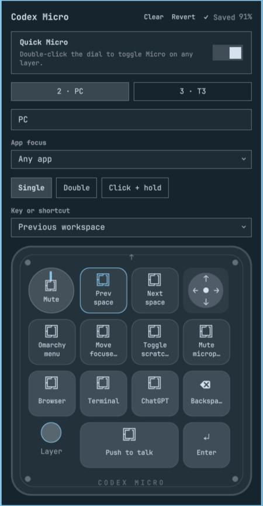

# Omarchy Codex Micro

A visual Omarchy plugin for configuring Codex Micro layers with typed JSON.
Map keys, dial, and joystick to keyboard keys, existing Omarchy shortcuts,
or explicit commands. Keep your mappings in files you can inspect and version.

**0.1.0 alpha.** Tested on one Omarchy workstation with Micro firmware 0.6.2,
over USB and Bluetooth. Installation on a second machine is not yet verified.
This is an independent community project, not an official OpenAI product.



The screenshot shows customized mappings; fresh installs start with portable defaults.

## Features

- Physical device layout with searchable key and shortcut selection.
- Editable layer names, automatic saving, per-layer Clear and Revert.
- Single click, double click, and click-then-hold gestures.
- Optional app focus before each action on an assigned layer.
- Push-to-talk press/release support for Omarchy's stock F9 dictation binding.
- **Quick Micro:** double-click the dial to toggle the editor on any layer.
- USB and Bluetooth configuration, status, backups, and verified writes.
- Strict JSON validation and schema completion; no firmware flashing.

Layer 1 remains Codex-owned except for the optional Quick Micro dial-double
override. Layers 2 and 3 are editable. Other device profiles and
`smart_actions.json` are preserved.

## Requirements

- Omarchy with the Lua Hyprland API and the shell's `KeyboardPanel` component.
  Older text-config Hyprland releases are not supported.
- Python 3.11 or newer, `libxkbcommon`, and a running Wayland desktop session.
- Codex Micro, vendor/product `303a:8360`, firmware **0.6.2**.
- User access to its HID interface; see the udev step below.
- For app focus: existing user access to `/dev/uinput`. Saving an app assignment
  fails clearly if it is unavailable. The plugin does not grant broad input access.
- Optional: Voxtype for dictation; other selected shortcuts require their apps.

No pip dependencies, device grab, root daemon, or separate Bluetooth service
are required. Pair Bluetooth through your usual system settings first.
Do not edit the device through Input at the same time: Input can overwrite
these changes from its cached configuration.

## Install

Clone the repository somewhere permanent. If the repository is private,
authenticate with GitHub first.

```bash
git clone https://github.com/fraction12/omarchy-codex-micro.git
cd omarchy-codex-micro
scripts/install
```

The installer creates `config/mappings.json` from `config/defaults.json` only
when it does not already exist. Personal mappings are ignored by this Git
repository; updates do not overwrite them. The starter layers contain basic
navigation keys and otherwise unassigned controls, with app focus and Quick
Micro off. Installation does **not** upload these defaults to the device.

The checkout is linked at `~/.config/omarchy/plugins/fraction12.codex-micro`.
The installer backs up host bindings, adds one generated-file include to
`~/.config/hypr/bindings.lua`, validates/reloads Hyprland, and enables the widget.
Failed setup steps restore the host files and plugin link from a private backup.
Open it from the bar and assign your controls. The first action change uploads
the complete configured layers 2 and 3; inspect the starter mappings first.

For HID access, install the narrow device-specific rule once, then reconnect:

```bash
sudo install -m 0644 udev/70-omarchy-codex-micro.rules /etc/udev/rules.d/70-omarchy-codex-micro.rules
sudo udevadm control --reload-rules
```

The rule grants the active local seat access to this device's USB/Bluetooth
vendor interface. It does not grant general keyboard or uinput access.

To add a normal keyboard shortcut in your own `bindings.lua`, choose an unused
combination, for example:

```lua
o.bind("SUPER + CTRL + M", "Codex Micro", "omarchy-shell shell toggle fraction12.codex-micro '{}'")
```

## Configuration as code

```bash
scripts/micro init             # Create local mappings if missing
scripts/micro validate
scripts/micro cheatsheet
```

Edit `config/mappings.json`; `config/mappings.schema.json` supplies editor
completion. To version personal mappings, keep them in your own dotfiles
repository or private backup, separately from plugin source updates.

A binding may be a plain key, a chord, or an existing Omarchy shortcut:

```json
{
  "label": "Commands",
  "action": {"kind": "key", "key": "KC_K", "modifiers": ["CTRL"]},
  "gestures": {
    "double": {"label": "Sidebar", "action": {"kind": "key", "key": "KC_B", "modifiers": ["CTRL"]}},
    "tap_hold": {"label": "Tab", "action": {"kind": "key", "key": "KC_TAB"}}
  }
}
```

| Action kind | Fields | Behavior |
| --- | --- | --- |
| `key` | `key`, optional `modifiers` | Keyboard key or balanced chord |
| `keybind` | `binding`, `modifiers`, `key` | Validated existing Omarchy shortcut |
| `exec` | `argv` | Explicit argument vector, without implicit shell evaluation |
| `focus` | `direction` | Adjacent window: `l`, `r`, `u`, `d` |
| `workspace` | `target` | Number, `e+1`, `e-1`, or `previous` |
| `volume` | `delta` | Output volume change from -10 to 10, excluding zero |
| `herdr_workspace` | `label` | Unique workspace on the local Herdr server |
| `noop` | none | Unassigned |

Commands are trusted user configuration. `~/` arguments expand to the user's
home directory. Opening the editor or validating mappings does not execute them.

The physical key rows are 2 / 4 / 4 / 3. The wide microphone key can cover two
switches; assign dictation to `key10` and leave `key11` unassigned. Rotation
and joystick directions do not support click gestures. Long press inherits
Single; **Click + hold** means press, release, then press and hold. Gesture
recognition normally adds a 250 ms delay to distinguish a single click.

The popup saves action changes to the device with backup/readback verification.
Names and labels save locally. For edits made directly in JSON:

```bash
scripts/micro plan
scripts/micro apply --expected-sha256 <hash-from-plan>
scripts/install               # Refresh generated host bindings
omarchy restart shell
```

## App focus and dictation

Set a layer's **App focus** to a running application's window class, or select
**Any app** for ordinary keyboard behavior. In JSON, set `"app": "t3code"`
on a layer, for example. The app picker lists currently running classes.

Before dispatch, the router checks focus, focuses the most recently used
matching window if needed, and verifies it. If the app is closed or focus
fails, it skips input with a notification. It does not launch the app.
It focuses a window, not a particular text field inside that window.

Assigned layers use private F13–F24 triggers and a user-session uinput keyboard.
F9 dictation retains press/release behavior. The release path works after focus
changes; a watchdog handles missed releases and limits a hold to 120 seconds.
Held-key checks use physical XKB codes because F13 can be named `XF86Tools`
by the active keyboard layout. Modified chords are taps, not held modifiers.

The service records the latest routed action's control, layer, app class, and
time locally for diagnostics; it does not record typed text or audio.

## Quick Micro

Enable **Quick Micro** to toggle the popup with dial double-click on every
layer of the configured profile, including layer 1. This bypasses app focus
and works on the current desktop. In JSON: `"quick_micro": true`.

The dial's other assignments remain intact. Saved double-click assignments
return when Quick Micro is disabled, including the original Codex-layer dial.
The picker marks dial double-click as reserved while the feature is on.
The private host shortcut is Ctrl+Shift+F24. It works in an unlocked Omarchy
session with the plugin installed, not above a lock screen or on another host.

## Backup, recovery, and uninstall

Backups live in `~/.local/state/omarchy-codex-micro/`. Device snapshots contain
original bytes, checksums, and device identity; saves also retain local mappings
and generated host bindings. They may contain personal commands and paths, so
keep them private. Per-layer Revert restores the preceding saved bindings;
it does not revert the global Quick Micro setting or app assignment.

```bash
scripts/micro snapshot
scripts/micro plan
scripts/micro restore /path/to/backup --expected-sha256 <current-device-hash>
```

Restore checks identity and checksums, and refuses changes outside the supported
layer boundary. USB and Bluetooth report different device identities, so use
snapshot restore through the same transport that created the backup.

Restore desired device mappings **before** uninstalling. Disabling the plugin
alone does not remove native shortcuts stored on the Micro.

```bash
scripts/uninstall
```

Uninstall removes the plugin symlink and generated host bindings. It retains
the checkout, personal mappings, backups, device mappings, and udev rule.
Remove the udev rule manually if no longer needed, reload rules, and reconnect.

## Updates

```bash
git pull --ff-only
scripts/install
omarchy restart shell
```

Read release notes before updating device firmware. Keep personal mappings
backed up. Other firmware versions are deliberately rejected for writes.

## Development and verification

```bash
PYTHONPATH=src python -m unittest discover -s tests -v
scripts/micro --config config/defaults.json validate
tests/run-qml-tests
omarchy plugin validate "$PWD"
```

GitHub CI tests Python 3.11 and 3.13 and validates the portable defaults.
QML tests require an installed Omarchy shell and a Wayland session: most tests
run offscreen, while the hidden mapping test needs `KeyboardPanel`'s Wayland
backend. They do not send desktop input or write device mappings.

See [CONTRIBUTING.md](CONTRIBUTING.md) and [CHANGELOG.md](CHANGELOG.md).
Hardware checks and current limits are documented in [docs/testing.md](docs/testing.md).

## License

[MIT](LICENSE).
